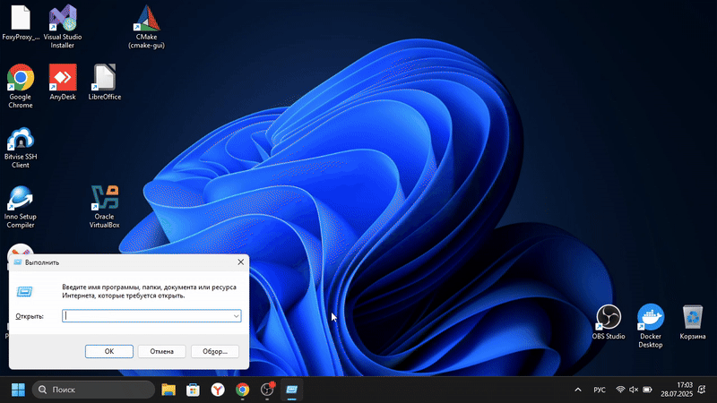

# Password_Checker С++

Проект, сделанный на языке программирования С++, предназначен для подбора пароля к учетной записи Windows.

## Установка и запуск скрипта

Сначала клонируйте репозиторий

```bash
git clone -b password_checker_c++ https://github.com/separeit894/password_checker
```

### Затем скомплируйте файл через компилятор g++ или же clang++

Для g++:

```bash
g++ -o main main.cpp load_and_save_progress\load_and_save_progress.cpp attemptLogin\attemptLogin.cpp
```

Для clang++:
```bash
clang++ -o main main.cpp load_and_save_progress\load_and_save_progress.cpp attemptLogin\attemptLogin.cpp
```

## Тестирование 

Перед тестированием **отключите ограничение на количество попыток входа в учетную запись!** В противном случае ваша учетная запись Windows может быть заблокирована.



# Ответственность пользователя

**Используя этот проект, вы соглашаетесь с тем, что несете полную ответственность за его использование. Разработчик не несёт ответственности за любые убытки, повреждения или другие последствия, возникающие в результате использования данного программного обеспечения. Пожалуйста, используйте его на свой страх и риск.**