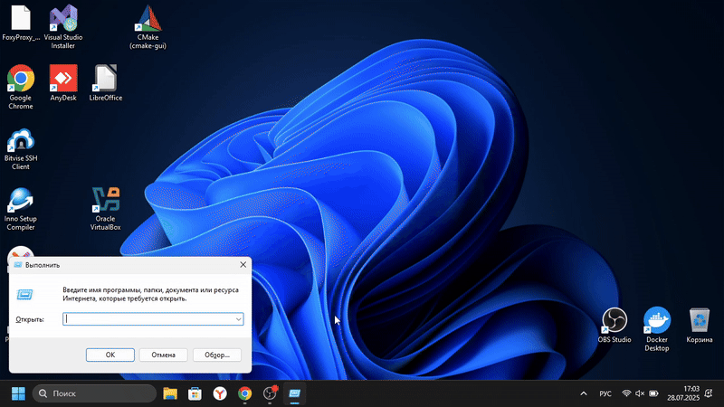

# Password_Checker

**Проект, сделанный на Python, предназначен для проверки аутентификации пароля к учетной записи Windows.**

## Cодержание

- [Установка скрипта](#установка-скрипта)
- [Установка зависимостей](#установить-зависимости)
- [Запустить скрипт](#запустить-скрипт)
- [Тестирование скрипта](#тестирование-скрипта)
- [Отвественность пользователя](#ответственность-пользователя)

## Установка скрипта

Клонируйте репозиторий

```bash
git clone https://github.com/separeit894/password_checker
```

### Установить зависимости 

```bash
pip install -r requirements.txt
```

### Запустить скрипт

**В командной строке Windows ввести:**

```bash
python main.py
```

## Тестирование скрипта

Перед тестированием **отключите ограничение на количество попыток входа в учетную запись!** В противном случае ваша учетная запись Windows может быть заблокирована.




## Используемые библиотеки

* Pillow
* pygame
* pywin32

## Ответственность пользователя

**Используя этот проект, вы соглашаетесь с тем, что несете полную ответственность за его использование. Разработчик не несёт ответственности за любые убытки, повреждения или другие последствия, возникающие в результате использования данного программного обеспечения. Пожалуйста, используйте его на свой страх и риск.**

